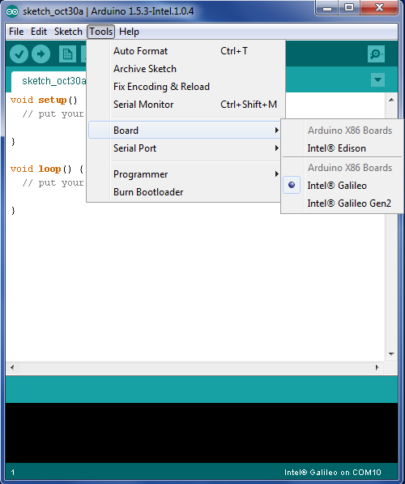
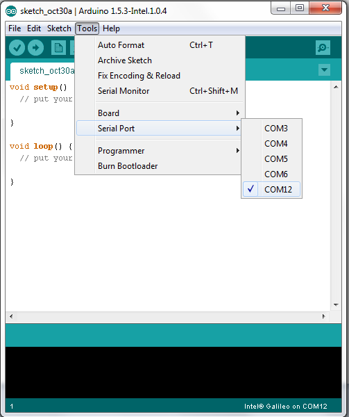
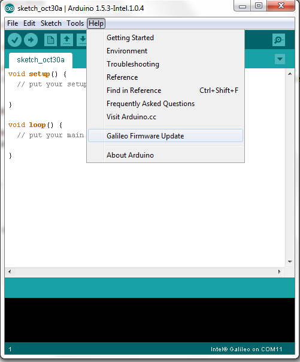
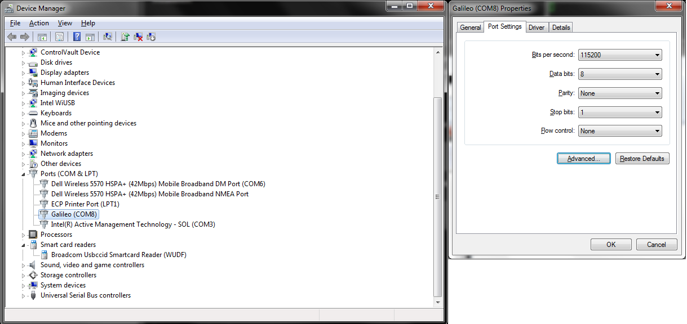
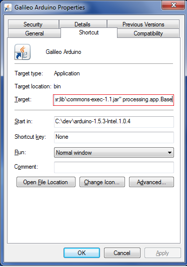
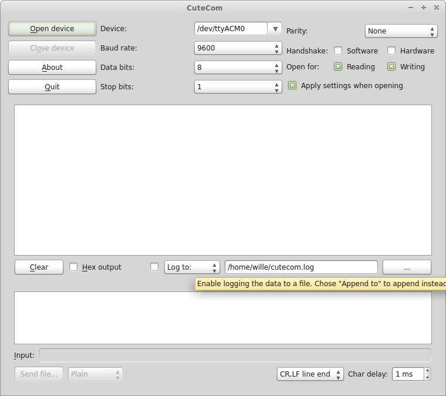

# Multicopter
This repository contains instructions on building an autonomously navigating quadcopter.

## Hardware
The autonomously navigating multicopter (drone) is built using the following parts. Some of the links point to the shops that we bought the items from. The software instructions are only specific to Intel Galileo, RPLidar and ArduPilot based flight controller. This means that the other parts can be swapped to different models without any effect to instructions.

### Frame
| Function               | Model                                                                                                                                     | Amount  |
| ---------------------- |:-----------------------------------------------------------------------------------------------------------------------------------------:| -------:|
| Carbon fiber (roving)  | [Generic](http://www.hp-textiles.com/shop/product_info.php?info=p881_100m-50k-carbon-fibre-roving--hp-ht-50k-100.html)                    |  1m^2   |
| Epoxy laminating resin | [Generic](http://www.hp-textiles.com/shop/product_info.php?info=p1054_1400g-epoxy-industrial-laminating-resin-system---hp-e56l-1400.html) |  800ml  |
| Glass filament fabric  | [Generic](http://www.hp-textiles.com/shop/product_info.php?info=p54_78g-m--glass-filament-fabric-finish-plain---hp-p78ef.html)            |  1m^2   |
| Peel ply fabric        | [Generic](http://www.hp-textiles.com/shop/product_info.php?info=p150_105g-m--peel-ply-twill---hp-t105p100.html)                           |  1m^2   |

### Flight hardware
| Function               | Model                                                                                                                                                              | Amount  |
| ---------------------- |:------------------------------------------------------------------------------------------------------------------------------------------------------------------:| -------:|
| Flight Controller      | [HKPilot Mega 2.7](http://www.hobbyking.com/hobbyking/store/__56052__HKPilot_Mega_2_7_Flight_Controller_USB_GYRO_ACC_MAG_BARO.html)                                |    1    |
| Motors                 | [Multistar 2212 - 920KV](http://www.hobbyking.com/hobbyking/store/__62796__Multistar_2212_920KV_Multi_Rotor_Motor_Set_w_CW_and_CCW_Threaded_Shafts_4pcs_box_.html) |    1    |
| Motor Controller       | [Turnigy Multistar ESC 2-4S](http://www.hobbyking.com/hobbyking/store/__25364__Turnigy_Multistar_20_Amp_Multi_rotor_Brushless_ESC_2_4S.html)                       |    4    |
| Propellers             | [DJI Phantom 2 Propeller Pair](http://www.quadcopters.co.uk/dji-phantom-2-propeller-pair-self-tightening-1211-p.asp)                                               |    4    |


### Sensors & Navigation hardware
| Function               | Model                                                                                                               | Amount  |
| ---------------------- |:-------------------------------------------------------------------------------------------------------------------:| -------:|
| 2D Laser range scanner | [RPLidar](http://www.seeedstudio.com/depot/RPLIDAR-360-degree-Laser-Scanner-Development-Kit-p-1823.html)            |    1    |
| Infrared sensor        | [Sharp GP2Y0A02YK0F](http://www.seeedstudio.com/depot/Analog-Infrared-Distance-Measuring-Sensor20150cm-p-1493.html) |    4    |
| Ultrasonic sensor      | [HC-SR04](http://www.hobbyking.com/hobbyking/store/__31136__ultrasonic_module_hc_sr04_arduino.html)                 |    5    |


### Other
| Function               | Model                                                                                                                            | Amount  |
| ---------------------- |:--------------------------------------------------------------------------------------------------------------------------------:| -------:|
| Small battery          | [Turnigy Nano-Tech 3000mAh](http://www.hobbyking.com/hobbyking/store/uh_viewItem.asp?idProduct=32623)                            |    1    |
| Large battery          | [ZIPPY Flightmax 4000mAh](http://www.hobbyking.com/hobbyking/store/__35806__ZIPPY_Flightmax_4000mAh_3S1P_20C_EU_warehouse_.html) |    1    |
| Microcontroller        | [Intel Galileo Gen 1](http://www.intel.com/content/www/us/en/do-it-yourself/galileo-maker-quark-board.html)                      |    1    |
| Class 10 SDHC Card     | [Trancend 16GB](http://www.transcend-info.com/Products/No-414)                                                                   |    1    |
| Wlan Adapter (USB)     | [Asus WL-167g v3](http://www.asus.com/Networking/WL167G_V3)                                                                      |    1    |

We selected two batteries with different weights. The smaller battery weighted 231g while the bigger one weighted 306g.

## Software
Our software stack is built on

[Debian Wheezy](http://sourceforge.net/p/galileodebian/wiki/Home/) (Specificly built for Galileo boards)

[ROS Hydro](http://wiki.ros.org/hydro)

ROS packages:
[RPLidar](http://wiki.ros.org/rplidar),
[Hector Slam](http://wiki.ros.org/hector_slam),
[Hector Navigation](http://wiki.ros.org/hector_navigation)

## Installation instructions
### Update Firmware
Download Arduino IDE for Galileo from [here](https://communities.intel.com/docs/DOC-22226)  

Open Arduino IDE and make sure that the board and serial port settings are correct.

[  ](doc/img/arduino_board.png "Select board")

[  ](doc/img/arduino_port.png "Select port")

Select ```Galileo Firmware Update``` from the ```Help``` menu.  
[  ](doc/img/arduino_ide.png "Update firmware")

**Windows specific instructions**  
 The port settings can be changed from the device manager.
[  ](doc/img/device_manager.png "Device manager")

If the Arduino IDE splash screen flashes, but nothing happens after that, it might be a problem with the locale.  
You can get around this by creating a shortcut and appending these to the parameters:
```
[arduino directory]\java\bin\javaw -Duser.language=en -Duser.region=US -Xms128m -Xmx128m -classpath "lib;lib\pde.jar;lib\core.jar;lib\jna.jar;lib\ecj.jar;lib\RXTXcomm.jar;lib\commons-exec-1.1.jar" processing.app.Base
```
[  ](doc/img/arduino_fix.png "Arduino fix")

Source: https://communities.intel.com/thread/45615

### Download the latest premade image from [here](http://sourceforge.net/projects/galileodebian)
### Write the image to your sd card
#### Linux
On a Linux system, use the dd command to write the downloaded image to whichever device is you SD card. Typing ```mount``` or ```ls -l /dev/disk/by-id``` will show you the devices and where they are mapped.
```
dd if=[path_to_image] of=[path_to_device]
```
For example:
```
dd if=/home/user/galieo-1.2.img of=/dev/sdb
```

#### Windows
Download a tool called Rawrite32 and use it to write the image to your SD card.
http://www.netbsd.org/~martin/rawrite32/download.html

### Connect to galileo
#### Linux
Find out the COM port galileo uses by typing ```dmesg | grep tty```.
Connect to the serial port using minicom, screen, cutecom or similar.

[  ](doc/img/cutecom.png "Cutecom")

Note! In ubuntu you also need add your user to the dialout user group in order to use serial devices.  
```
usermod -a -G dialout user
```

#### Windows
Open device manager to find out the COM port galileo uses and then connect to the COM port using putty or similar tool. There might be a long delay between establishing connection and seeing the login screen.

### Expand the partition to full sd card size

Run the resizepart command of parted to expand the root partition (actually the 2nd partition on the SD card).  
It will ask several questions, but that is expected. **Do Not Panic.**  
```parted /dev/mmcblk0 resizepart 2 ```

First will be two scary looking messages complaining about the GPT table not being at the end of the device, and also asking if you want to use the entire device. In both cases, just allow parted to fix the problem. It actually knows what it is doing.  
```
 Error: The backup GPT table is not at the end of the disk, as it should be.
 This might mean that another operating system believes the disk is smaller.
 Fix, by moving the backup to the end (and removing the old backup)?
 parted: invalid token: 2
 Fix/Ignore/Cancel? f
```

```
 Warning: Not all of the space available to /dev/mmcblk0 appears to be used, you
 can fix the GPT to use all of the space (an extra 5986304 blocks) or continue
 with the current setting?
 Fix/Ignore? f
```

Now it is going to prompt you for the details of the resize operation. The OS is on partition 2, and you do want to change it even though are currently using it. You are just growing it, so this is safe.

```
 Partition number? 2
 Warning: Partition /dev/mmcblk0p2 is being used. Are you sure you want to
 continue?
 Yes/No? yes
```
Now, tell it the size of your SD card. SD cards are always slightly smaller their advertised size, so provide a value about 10% smaller than the size of the card. The value 2020MB used below is just an example. Use whatever number is right for your SD card.

```
 End?  [944MB]? 2020MB
 Error: Partition(s) 2 on /dev/mmcblk0 have been written, but we have been unable to
 inform the kernel of the change, probably because it/they are in use.  As a result, the
 old partition(s) will remain in use.  You should reboot now before making further
 changes.
 Ignore/Cancel? I
```

You will need to reboot now so the kernel will see the new partion table.

The final step is to resize the filesystem:  
``` resize2fs /dev/mmcblk0p2 ```  

Instructions taken from [here.](http://sourceforge.net/p/galileodebian/wiki/How%20to%20expand%20the%20root%20filesystem%20to%20use%20the%20entire%20SD%20card/)

### Update galileo

Fetch updated repositories and update installed packages.

```
apt-get update && apt-get upgrade
```

### Install ROS Hydro

```
sudo sh -c 'echo "deb http://packages.ros.org/ros/ubuntu wheezy main" > /etc/apt/sources.list.d/ros-latest.list'
wget http://packages.ros.org/ros.key -O - | sudo apt-key add -  
sudo apt-get update && sudo apt-get upgrade
sudo apt-get install python-rosdep python-rosinstall-generator python-wstool build-essential python-rosinstall
wget --no-check-certificate https://bootstrap.pypa.io/get-pip.py
python get-pip.py
sudo rosdep init
rosdep update
mkdir ~/ros_catkin_ws
cd ~/ros_catkin_ws
rosinstall_generator ros_base --rosdistro hydro --deps --wet-only > hydro-desktop-full-wet.rosinstall
wstool init -j8 src hydro-desktop-full-wet.rosinstall
rosdep install  --from-paths src --ignore-src --rosdistro hydro -y --os=debian:wheezy
cd ~/ros_catkin_ws
./src/catkin/bin/catkin_make_isolated --install
```
http://wiki.ros.org/IntelGalileo/Debian

### Create new workspace for ROS
```
cd ~/
mkdir -p catkin_ws/src/
cd catkin_ws/src/
catkin_init_workspace
```

### Clone required packages to your workspace
RPLidar node handles the publishing of the laserscan data. Clone it using the following command.
```
export GIT_SSL_NO_VERIFY=true
git clone https://github.com/robopeak/rplidar_ros.git
```
```GIT_SSL_NO_VERIFY=true``` is needed because the time service (stpd) is not working in galileo debian.

Clone hector_slam package that contains hector_mapping and related packages.
```
git clone https://github.com/tu-darmstadt-ros-pkg/hector_slam.git
```
Clone a custom hector_navigation package that is forked from the original one.
```
git clone https://github.com/Kalifi/hector_navigation.git
```

Clone this project to e.g. to your home directory and create a symbolic link between the client_node folder and your catkin workspace.
```
cd ~/
git clone https://github.com/sanmarh1/multicopter.git
ln -s ~/multicopter/client_node catkin_ws/src/client_node
```
Create a symbolic link between the multicopter pakcage launch file and catkin workspace.  
```
cd ..
ln -s ~/multicopter/launch launchAll
```
Modify the files package.xml and CMakeLists.txt in ~/catkin_ws/src/hector_slam/hector_map_tools by adding the following.

**package.xml:**
```
<build_depend>cmake_modules</build_depend>
<run_depend>cmake_modules</run_depend>
```
**CMakeLists.txt:**
```
find_package(cmake_modules REQUIRED)  
find_package(Eigen REQUIRED)
```
Build cloned packages using ```catkin_make```.
```
cd ..
catkin_make
```
Make the launch file executable.
```
chmod a+x launchAll
```
Now the project can be launched typing ```./launchAll```

## Setting up remote rviz connection

### Configure WLAN adapter
The Asus WL-167g v3 WLAN adapter uses a Realtek chipset (RTL8188SU). To use it, we have to install realtek drivers.

## Toolchain for software development

Toolchain for software development is mandatory, if new components should be cross-compiled for the Intel Galileo + ROS setup. This section describes the steps requires to build your toolchain. Please note, that currently this works ONLY for 32 bit host systems. It is also greatly preferred that this toolchain and ROS are installed for the virtual machine, so setting up toolchain won't break your host computer. In this example, a VirtualBox image with Ubuntu 12.04 and ROS Hydro is used (running under Arch Linux host).

### Setup up your virtual machine (optional)

Install the virtual machine and 32 bit Linux system for it. The recommended setup is 32 bit Ubuntu guest with ROS Hydro. See [VirtualBox installation manual](http://www.virtualbox.org/manual/ch01.html) for setting up Ubuntu environment and [ROS Hydro installation for Ubuntu](http://wiki.ros.org/hydro/Installation/Ubuntu) to proceed. If you are using your own host OS for these setups, please be careful.

### Get the SDK

Install toolchain for your operating system (in this example, the host machine Linux is used) from Intel site. The file is named "Toolchain_GPLCompliance.src.VERSIONUMBER.tar.bz2" and can be downloaded [here](https://communities.intel.com/docs/DOC-22226). (1.0.3 was used)

Extract the downloaded package
```
tar xvvf Toolchain_GPLCompliance.src.VERSIONNUMBER.tar.bz2
```
And install the toolchain with ```sh toolchain-20140724-linux32.sh```. Note that default installation path is under ```/opt/poky-edison/1.6``` so root priviledges are required. You can also install it whereever you want.

The actual toolchain is now installed for your installation folder. However, it lacks the multiple dependencies for cross-compiling, so all of them must be compiled manually for the toolchain.

### Applying the toolchain

Apply the toolchain environment, run in your current terminal window
```
source /path/to/your/toolchain/environment-setup-core2-32-poky-linux
```

This step must be performed every time you open a new terminal. If you want to load these options automatically for every opened terminal, you can edit your ```~/.bashrc``` (if bash is used) and add the line above to the end of the file. Please note, that this step also disables your operating systems default compiler variables.

### Install dependencies

TODO: More information coming for dependencies...

### Transfer and run your cross-compiled program on Intel Galileo

When you have successfully built your program with your development PC, you can transfer it to Intel Galileo catkin workspace. There are various ways to do this:

1) Transfer the file through the serial port (slow)
2) Copy your files to SD-card, where your Debian is installed
3) If connected to Internet, copy the file through FTP/HTTP/etc.
4) Your own choice

You can choose whatever method you want, and these methods are not explained here.

Your have to copy your binaries and sources from the development catkin workspace, which are ```catkin_ws/src``` and ```catkin_ws/build```. Folder ```catkin_ws/devel``` shall *NOT* be touched! From ```src``` folder, your compiled program sources (eg. rplidar_ros) can be copied, but in the ```build``` folder, you can append the new files to the existing folder.

When you have transferred the files to your Intel Galileo catkin workspace, you can run these normally. You have successfully cross compiled and run new executables.

### Running multicopter_map as service

Copy roslaunch file from multicopter_map to your init.d. Make sure you update ROS_PACKAGE_PATH, HOME, ROS_HOME, ROS_IP and the ip in grep command (line 27). You can choose whether to run multicopter_package in screen or not by commenting either line 40 or 41.

After moving the script to init.d and changing variables, package should start when device gets it's ip address. You can also start the package by typing "service roslaunch start" in terminal.


